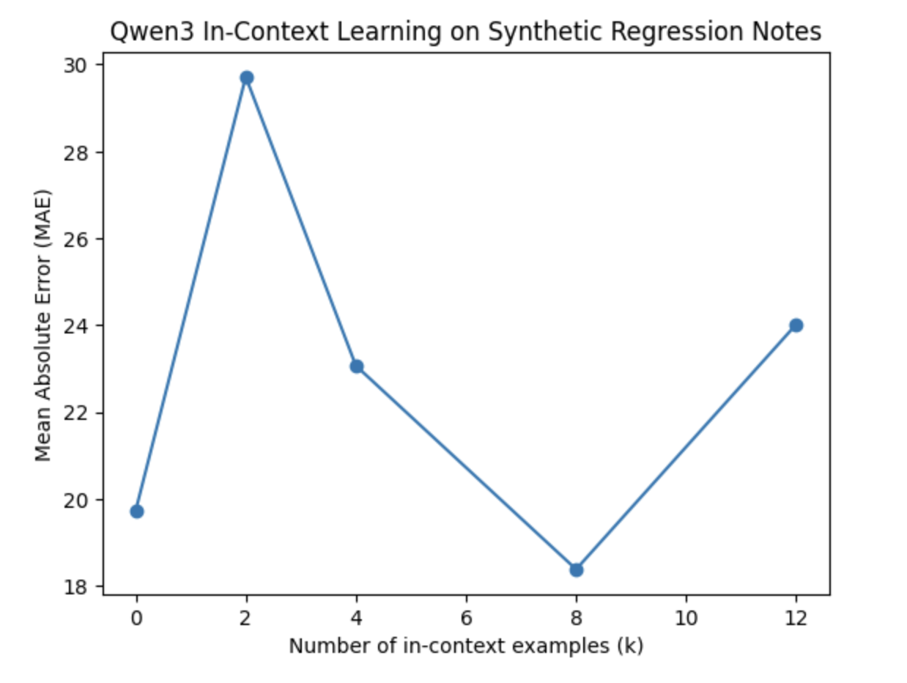

# Clinical Notes Scoring with LLM

A demonstration of in-context learning with Qwen3 for scoring clinical notes.

## Key Idea

* Use in-context learning to test whether an LLM can learn to map clinical-style text notes to numeric scores.
* Provide *k* example `(note → score)` pairs **in the prompt**
* Ask the model to predict the score for a new note
* Evaluate performance as the number of in-context examples varies.

## Demo Setup

### Synthetic Data

* Generate clinical notes from structured features:

  * age, vitals, grip strength, walking speed, pain, fatigue
* Define a regression function that maps the clinical notes to score of **0–100**.

### Model

* **Qwen3 (0.6B)** via Hugging Face
* Deterministic decoding (`temperature = 0`)
* No fine-tuning or training

## Evaluation

* Metric: **Mean Absolute Error (MAE)**
* MAE = average absolute difference between predicted and true scores
* Lower MAE indicates better generalization

We evaluate MAE for different numbers of in-context examples (*k*).

## Results

* Performance varies non-monotonically with *k*
* Moderate numbers of examples often reduce MAE
* Too many examples can degrade performance due to overfitting or context interference

### Sample output

* k= 0 | MAE=24.70
* k= 2 | MAE=24.78
* k= 4 | MAE=30.65
* k= 8 | MAE=24.11
* k=12 | MAE=23.73

There is a non-monotonic relationship between the number of in-context examples and prediction error:

* k small → high variance, unstable
* k medium → best bias–variance balance
* k large → overfitting to prompt examples

